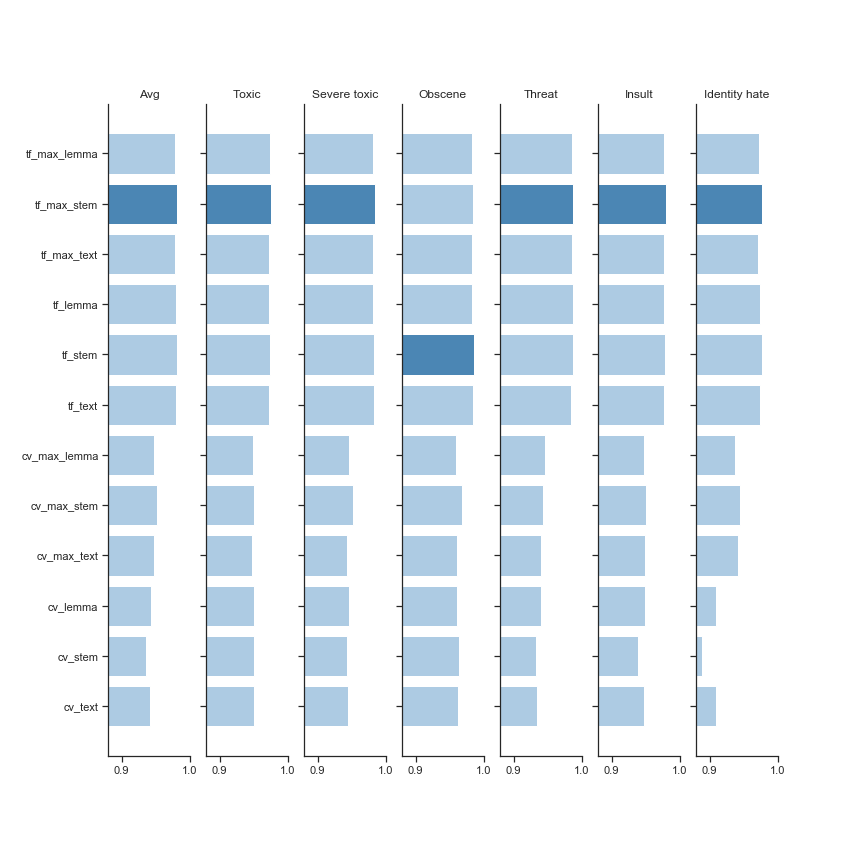

# NLP Project - Toxic Comment Classifcation

## Detecting Toxic Comments.
- 6 heads under which each comment can be classified.
- Preprocessed data - using Stemming and Lemmatization.
- Used Count Vectorizer (TF) and TFIDF Vectorizer to convert text to numbers.
- Used Logistic Regression as a classifier to predict labels.
- 6 classifiers for 6 independent heads.
- Ran for various possibles combinations with different classifiers like Naive Bayes, SVM, DecisionTrees and Logistic Regression.

### Results
- NB ~ 0.94
- SVM ~ 0.962
- DT ~ 0.968
- LR ~ 0.975

### Results for LR


```
Score for toxic         is 0.975133898127067
Score for severe_toxic  is 0.9848534035920431
Score for obscene       is 0.9850845071108659
Score for threat        is 0.9873402246798102
Score for insult        is 0.9798890140128306
Score for identity_hate is 0.9769750074770984
Score                    : 0.9815460091666193
```


## Expanding to some prototype - Hate Speech Chrome Extension
- Developed a chrome extension to demonstrate the application of above trained models in real-life sites like reddit to detect toxic, obscene, hate type of comments.
- Used a flask app for connecting model to chrome extension.

#### Demo
- Run the flask server.
```
d:
cd Code/nlp/flask/
conda activate nlp
$env:FLASK_ENV = "development"
flask run
```
- Open a toxic page. [Link 1](https://www.reddit.com/r/atheism/comments/dmwmhh/if_youre_religious_you_should_be_disqualified/) OR [Link 2](https://www.reddit.com/r/4chan/comments/a0324h/helping_the_irs_catch_th0ts/)
- Click on HS Icon on extension bar.